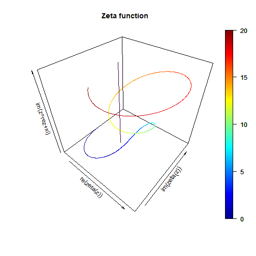

Zeta
========================================================
author: David Larue
date: July 1,2019
autosize: true

Riemann Zeta Function
========================================================

- The Riemann Zeta function is defined on complex numbers as $\zeta(z)=\sum_{n=1}^{\inf}\frac{1}{n^z}$
- An old, famous, and difficult problem is to show that  
  the non-trivial zeroes of the $\zeta(z)$ function lie on the critical line $z=0.5+yi$.
- Presented is an interactive web page permitting the exploration of the zeta function. 
- This compiled document is hosted at XXX.
- The source for this document, and for the associated Shiny application, is hosted at XXX.
- The interactive Shiny application itself, including its documentation, is a XXX.

Computing Zeta
========================================================

We make use of the R library "pracma" to compute values of the zeta function.


```r
library(pracma)
z=2+3i
zeta(z)
```

```
[1] 0.798022-0.1137443i
```

3D Plots of Zeta
========================================================

We present several 3-Dimensional plots of the zeta function along various line segments of z with fixed real part. Here is zeta(z) on z=0.5+yi,  with y from 0 to 20, using the library "plot3D".



2D Plots of Zeta
========================================================

Also we give a 2 Dimentional plot of the real and complex parts of zeta(z) separately.


